# AeroMesh BRICS: Finalized System Architecture & Strategy Blueprint

> **Platform Tagline:** *Detect Locally. Predict Regionally. Coordinate Globally.*
> 
> **Core Concept:** An AI-powered, federated climate action platform that fuses citizen evidence, local sensor networks, satellite remote sensing, and meteorological vectors to detect hidden pollution events, forecast atmospheric plume dispersion across economic corridors, and coordinate rapid inter-agency interventions while respecting national data sovereignty.

---

## Executive Summary & Strategic Positioning

Conventional air quality platforms function as passive monitoring dashboards—displaying static AQI numbers hours after pollution has already settled over cities. **AeroMesh** transforms air quality management from *passive observation* to an **active, event-driven early-warning and inter-agency dispatch network**.

```
[ Traditional Systems ]   Monitoring  ──▶  AQI Map  ──▶  Public sees bad air (Too late)

[ AeroMesh Platform ]     Multi-Source Fusion  ──▶  AI Hotspot Event Detection
                                                     │
                                                     ▼
                          Rapid Authority Action  ◄── Corridor Plume Forecast
```

### Core Terminology & Key Definitions
* **Pollution Plume**: A moving cloud or column of smoke and chemical emissions released from point/area sources (e.g., farm stubble burning or factory chimneys) that is carried downwind across the landscape.
* **Transboundary Alert**: Automated warnings dispatched across administrative state boundaries or national borders when pollution originating in Region A is predicted to travel into Region B.
* **Atmospheric Mixing Height (PBLH)**: The vertical ceiling height up to which surface air and smoke are mixed. A low mixing height (e.g., 200m in winter/night) traps emissions near the ground causing hazardous smog, whereas a high mixing height (e.g., 2000m in summer) disperses pollutants upward.
* **Target Economic & Transport Corridors**:
  1. **Indo-Gangetic Plain Corridor (India)**: Punjab $\rightarrow$ Haryana $\rightarrow$ Delhi-NCR $\rightarrow$ Uttar Pradesh.
  2. **Industrial Economic Corridors**: Mumbai $\rightarrow$ Pune, Bengaluru $\rightarrow$ Chennai.
  3. **BRICS Regional Corridors**: Beijing–Tianjin–Hebei (China), São Paulo Industrial Zone (Brazil), Gauteng Region (South Africa).

### The Winning Demo Story
1. **12:00 PM (T = 0)**: Citizen uploads a geotagged photo of thick smoke in Punjab. Local IoT sensor detects a sharp PM2.5 rise (65 $\rightarrow$ 185 $\mu\text{g/m}^3$).
2. **12:02 PM**: AeroMesh Multi-Modal Fusion Engine cross-references sensor anomaly + photo CV plume detection + meteorological wind vectors.
   * *Result:* **Pollution Event Detected** (Confidence: 92%, Source: Biomass Burning).
3. **12:05 PM**: Plume Dispersion Simulator combines real-time wind speed (18 km/h SE) and Planetary Boundary Layer Height (PBLH) to project trajectory:
   * *Forecast:* **Delhi–NCR Corridor** expected PM2.5 spike to $320 \mu\text{g/m}^3$ in ~7.5 hours.
4. **12:08 PM**: Automated transboundary alert and anti-smog gun dispatch orders sent to regional authorities across state boundaries.
5. **03:30 PM (T + 3.5h)**: NASA VIIRS/MODIS satellite overpass confirms thermal fire cluster, automatically updating event confidence to 98% and refining plume boundary models.

---

## 2. Multi-Layer System Architecture

The AeroMesh architecture integrates 7 core technical layers backed by a sovereign Federated National/State Climate Node infrastructure running **Laya (Local Edge System-One Decision Engine)**.

```mermaid
flowchart TD
    subgraph L1["1. Data Sources"]
        C1[Citizen Reports & Photos]
        C2[Low-Cost IoT Sensors]
        C3[National AQ Networks - CPCB/OpenAQ]
        C4[Satellites - NASA FIRMS / Sentinel-5P]
        C5[Meteorology - Open-Meteo / ERA5]
    end

    subgraph L2["2. Ingestion & API Gateway"]
        G1[REST APIs / WebSocket Gateway]
        G2[Auth & OAuth2 / Rate Limiter]
        G3[Data Sanitization & Timestamp Normalizer]
    end

    subgraph L3["3. Storage Layer"]
        S1[(PostgreSQL + PostGIS)]
        S2[(TimescaleDB Time-Series)]
        S3[(Object Storage - MinIO/S3)]
    end

    subgraph L4["4. Data Fusion Engine"]
        F1[Spatio-Temporal Alignment]
        F2[Sensor Calibration & Weighting]
        F3[Multi-Source Evidence Matrix]
    end

    subgraph L5["5. AI Analytics Engine (Powered by Laya Engine)"]
        A1[Anomaly Detector - XGBoost/Autoencoder]
        A2[Vision Engine - Smoke/Plume Classifier]
        A3[Source Attribution Model]
        A4[Explainable AI - SHAP Values]
    end

    subgraph L6["6. Forecasting & Risk Engine"]
        P1[Gaussian Plume Dispersion Physics]
        P2[Planetary Boundary Layer Height - PBLH]
        P3[Corridor Risk Scorer]
    end

    subgraph L7["7. Action & Output Layer"]
        O1[Inter-Agency Command Center]
        O2[Transboundary Alert Engine]
        O3[Citizen Mobile Warning Portal]
    end

    L1 --> L2 --> L3 --> L4 --> L5 --> L6 --> L7
```



---

## 3. Local Decision Engine: Laya on Sovereign Edge Nodes

To enforce strict data privacy and eliminate cloud API latency, each sovereign node (e.g., India Node, China Node, Brazil Node) runs **Laya** as its local, air-gapped decision engine.

```
[ Sovereign Edge Node (e.g., India / China Node) ]
┌─────────────────────────────────────────────────────────┐
│ LAYA LOCAL ENGINE (System-One Decision Microservice)    │
│ • Local Ingestion of Raw Citizen Photos & Sensor Logs   │
│ • Sub-10ms Multi-Source Evidence Confidence Scoring     │
│ • Local PyTorch Computer Vision Smoke Verification      │
│ • Emits Signed JSON Event Schemas (No Raw Data Exited)  │
└──────────────────────────┬──────────────────────────────┘
                           │ Encrypted JSON Alerts & Weights
                           ▼
              [ BRICS Coordination Network ]
```

> [!TIP]
> **Why Laya over Jev?** 
> You only need **Laya**. While *Jev* is a broader System-One adjudication model concept, **Laya** is specifically designed as the lightweight, open-source, locally-deployable engine variant. Deploying Laya directly on sovereign edge nodes satisfies both **air-gapped local execution** and **sub-10ms deterministic evidence scoring** without needing duplicate tools.

---

## 4. Data Engineering & Multi-Temporal Scale Pipeline

A critical scientific distinction in AeroMesh is its handling of **Data Latency Disparities**:

| Data Layer | Resolution / Source | Refresh Frequency | System Role |
| :--- | :--- | :--- | :--- |
| **Citizen Photos & Geotags** | PWA + Browser Geolocation / EXIF | Real-Time ($T=0$) | **Zero-Latency Event Trigger** |
| **Ground Sensor Networks** | OpenAQ v3 API & CPCB (No Custom Hardware) | Real-Time / 15–60m | **Ground-Truth Calibration** |
| **Meteorological Vectors** | Open-Meteo API (Wind, Temp, PBLH) | Hourly | **Dispersion Vectors & Boundary Layer** |
| **Satellite Active Fires** | NASA FIRMS (VIIRS 375m / MODIS) | 3 Hours (NRT Overpass) | **Thermal Hotspot Verification** |
| **Atmospheric Pollutants** | Sentinel-5P (TROPOMI $\text{NO}_2/\text{SO}_2$) | Daily Pass | **Macro Plume & Chemical Baseline** |

### Citizen Geotagging & Incentive Mechanics
* **Geotagged Upload Pipeline**: Citizens submit photos through our PWA. The frontend invokes the **Browser Geolocation API** (`navigator.geolocation.getCurrentPosition()`) for live camera shots. For gallery uploads, the backend extracts embedded **EXIF metadata** (latitude, longitude, timestamp).
* **Citizen Incentive Model**:
  1. **Immediate Civic Feedback**: Citizens receive instant AI verification updates (*"AI verified smoke plume; alert sent to regional inspectors"*).
  2. **Hyperlocal Health Advisories**: Unlocks customized safety warnings (*"Smoke cloud approaching your zone in 2h — close windows & limit outdoor exercise"*).
  3. **Gamification & Civic Credits**: Earning "CleanAir Badges" and civic reward points redeemable for municipal benefits.

### Existing Ingestion Sources & Historical Baseline Storage
* **Zero Custom Hardware Required**: We tap directly into **OpenAQ v3 API** and official CPCB monitoring stations; no physical sensor deployment is required.
* **NASA FIRMS Integration**: Ingests near-real-time thermal hotspot points (VIIRS 375m & MODIS) updated every 3 hours globally via REST API.
* **Open-Meteo API**: Streams hourly wind speed, wind direction ($0^\circ$ to $360^\circ$), surface temperature, pressure, and Planetary Boundary Layer Height (`boundary_layer_height` in meters).
* **Historical Baseline Storage (TimescaleDB)**: Historical air quality logs (past 1–5 years) are stored in TimescaleDB hyper-tables indexed by `(location, month, hour_of_day)`. The engine computes rolling mean ($\mu_{\text{historical}}$) and standard deviation ($\sigma_{\text{historical}}$) to identify severe pollution anomalies ($>3\sigma$ or $+300\%$ over normal).

> [!IMPORTANT]
> **Data Latency Nuance:** Satellite overpasses are **not** real-time streams; they serve as daily macro validation anchors ($T+3\text{h}$ to $T+24\text{h}$), whereas ground IoT and citizen reports provide the instant $T=0$ trigger.

---

## 5. Multi-Modal AI Analytics Engine

AeroMesh employs 4 decoupled AI modules operating in sequence within the **Laya Engine** environment:

```
[ Raw Inputs ] ──▶ [ A. Anomaly Detection ] ──▶ [ B. Vision CV ] ──▶ [ C. Fusion & Attribution ] ──▶ [ D. Plume Dispersion ]
```

### Module A: Spatiotemporal Pollution Anomaly Detector
Detects statistical deviations relative to rolling historical baselines:
$$\text{Anomaly Score} = \frac{\text{PM}_{2.5}(t) - \mu_{\text{rolling}}}{\sigma_{\text{rolling}}} \cdot f(\text{Humidity}, \text{Temp})$$
* **Baseline Algorithm:** Isolation Forest / XGBoost Anomaly Classifier.

### Module B: Citizen Vision Plume Classifier
* **Input:** User-uploaded smartphone image + GPS metadata.
* **Architecture:** MobileNetV3 / ResNet-50 backbone fine-tuned for:
  * Optical haze density assessment.
  * Emission source classification (Biomass/Stubble Fire, Industrial Stack Plume, Vehicular Smog, Open Trash Fire).

### Module C: Multi-Source Evidence Fusion & Source Attribution Engine
Combines heterogeneous signals into a single defensive confidence score:

$$\text{Event Confidence } (C) = \sum_{i=1}^{n} w_i \cdot S_i$$

Where:
* $S_{\text{Sensor}} = \text{PM}_{2.5} \text{ Anomaly Score}$ ($w_1 = 0.30$)
* $S_{\text{FIRMS}} = \text{NASA Thermal Fire Proximity}$ ($w_2 = 0.25$)
* $S_{\text{Vision}} = \text{CV Plume Confidence}$ ($w_3 = 0.20$)
* $S_{\text{Wind}} = \text{Trajectory Alignment}$ ($w_4 = 0.15$)
* $S_{\text{Hist}} = \text{Seasonal Fire Pattern}$ ($w_5 = 0.10$)

```text
EVIDENCE FUSION BREAKDOWN (Scored by Laya Local Engine)
────────────────────────────────────────────────────
PM2.5 Sensor Anomaly (+112% over mean)   :  +30%
NASA FIRMS Active Fire within 4.2 km      :  +25%
Citizen Photo Smoke Classifier (88% CV)   :  +20%
Wind Trajectory Consistency               :  +15%
────────────────────────────────────────────────────
FINAL EVENT CONFIDENCE SCORE             :   90%  [VERIFIED]
```

### Module D: Plume Dispersion Physics & Corridor Risk Model
Instead of naive linear distance projection ($d = v \cdot t$), AeroMesh implements a **Gaussian Plume Dispersion Model** weighted by Planetary Boundary Layer Height ($\text{PBLH}$):

$$C(x,y,z) = \frac{Q}{2\pi u \sigma_y \sigma_z} \exp\left( \frac{-y^2}{2\sigma_y^2} \right) \left[ \exp\left( \frac{-(z-H)^2}{2\sigma_z^2} \right) + \exp\left( \frac{-(z+H)^2}{2\sigma_z^2} \right) \right]$$

#### Economic Corridor Risk Index
$$\text{Corridor Risk} = 0.35(\text{PM}_{2.5}) + 0.20(\text{NO}_2) + 0.20(\text{Plume Proximity}) + 0.25\left(\frac{1000}{\text{PBLH}}\right)$$

### Dual-Horizon Alerting Mechanics
```
                              ┌──▶ NEARBY (0–3 km)   : Immediate Ground Spike Alert (T = 0 to 15 mins)
[ Industrial / Stubble Fire ] ─┤
                              └──▶ FARAWAY (5–50 km) : Predictive Downwind Forecast Alert (T = +2 to +8 hours)
```

1. **Nearby Places (0 to 3 km)**:
   * **Trigger**: Instant PM2.5/NO₂ spike detected by local sensors or verified by citizen photos.
   * **Target Action**: Immediate notifications to local factory inspectors, nearby schools, and local residents (*"High local emissions detected within 1 km. Close windows & pause outdoor activity"*).
2. **Faraway Downwind Places (5 to 50 km)**:
   * **Trigger**: Gaussian Plume Dispersion Model calculates wind transport vector and boundary layer mixing height over the next 2–12 hours.
   * **Target Action**: Predictive transboundary early warning sent to downstream city authorities **hours before** the pollution plume arrives.

### Action Team Protocols & Automated Response Rules
* **Municipal Anti-Smog Squads**: Automatically dispatched to deploy water-sprinkling trucks and anti-smog guns to targeted urban sectors 4–6 hours *before* peak plume arrival.
* **Agricultural Enforcement Patrols**: Dispatched directly to active GPS coordinates where NASA FIRMS + Citizen CV confirm active crop stubble fires.
* **Industrial Inspectors**: Automated dispatch of inspection notices and temporary throttle orders to registered factory stacks located upwind of the affected corridor.

---

## 6. Federated Learning & Interoperability Architecture

AeroMesh uses **Sovereign National/State Nodes** to overcome data-sharing reluctance between government bodies.

```
[ India Node (Laya) ] ──┐
[ Brazil Node (Laya) ] ├──▶ Encrypted Model Weight Updates (Flower FL) ──▶ [ Global Base Model ]
[ China Node (Laya) ]  ──┘
```

> [!NOTE]
> **Data Sovereignty:** Raw citizen photos, industrial emission logs, and local sensor feeds **never** leave national node servers. Only standardized event JSON payloads and model weight gradients are exchanged.

### Inter-Agency JSON Event Schema (`brics_pollution_event_v1.json`)

```json
{
  "event_id": "AEROMESH-IN-2026-0984",
  "timestamp_utc": "2026-09-22T12:02:00Z",
  "origin_node": "IN-DPCC-DELHI",
  "event_type": "biomass_burning_stubble",
  "location": {
    "latitude": 30.7333,
    "longitude": 76.7794,
    "corridor": "IN-IGP-CORRIDOR-01"
  },
  "metrics": {
    "pm25_peak": 218.4,
    "no2_level": 42.1,
    "aerosol_index": 1.84,
    "pblh_meters": 320.0
  },
  "confidence_score": 0.92,
  "evidence_sources": ["ground_sensor", "firms_satellite", "citizen_cv"],
  "forecast": {
    "plume_vector_deg": 145.0,
    "wind_speed_kmh": 18.5,
    "affected_corridors": ["Delhi-NCR", "Noida-GreaterNoida"],
    "arrival_window_hours": 7.5,
    "projected_peak_pm25": 335.0
  },
  "recommended_actions": [
    "DEPLOY_ANTI_SMOG_GUNS_SECTOR_4",
    "ISSUE_INDUSTRIAL_THROTTLE_NOTICE",
    "PUBLIC_HEALTH_ADVISORY_VULNERABLE"
  ]
}
```

---

## 7. Geospatial Database Schema (PostgreSQL + PostGIS)

```sql
-- PostGIS Extension for Geospatial Queries
CREATE EXTENSION IF NOT EXISTS postgis;

-- 1. Measurements Table (Time-Series Ground Data)
CREATE TABLE measurements (
    id BIGSERIAL PRIMARY KEY,
    sensor_id VARCHAR(64) NOT NULL,
    location GEOMETRY(Point, 4326) NOT NULL,
    timestamp TIMESTAMPTZ NOT NULL,
    pm25 FLOAT,
    pm10 FLOAT,
    no2 FLOAT,
    so2 FLOAT,
    source_type VARCHAR(32) -- 'openaq', 'citizen_iot', 'cpcb'
);
CREATE INDEX idx_measurements_geo ON measurements USING GIST(location);
CREATE INDEX idx_measurements_time ON measurements(timestamp DESC);

-- 2. Pollution Events Table
CREATE TABLE pollution_events (
    event_id VARCHAR(64) PRIMARY KEY,
    origin_country VARCHAR(4) NOT NULL,
    event_type VARCHAR(64) NOT NULL,
    centroid GEOMETRY(Point, 4326) NOT NULL,
    severity VARCHAR(16) NOT NULL, -- 'LOW', 'MEDIUM', 'HIGH', 'CRITICAL'
    confidence_score FLOAT NOT NULL,
    detected_at TIMESTAMPTZ NOT NULL,
    plume_polygon GEOMETRY(Polygon, 4326),
    predicted_vector_deg FLOAT,
    status VARCHAR(32) DEFAULT 'ACTIVE' -- 'ACTIVE', 'MITIGATED', 'RESOLVED'
);
-- 3. Regional Inspector Jurisdiction Schema
CREATE TABLE inspector_jurisdictions (
    inspector_id VARCHAR(64) PRIMARY KEY,
    name VARCHAR(128) NOT NULL,
    phone_number VARCHAR(32) NOT NULL,
    whatsapp_id VARCHAR(64),
    assigned_zone GEOMETRY(Polygon, 4326) NOT NULL,
    active_status BOOLEAN DEFAULT TRUE
);
CREATE INDEX idx_inspector_zone ON inspector_jurisdictions USING GIST(assigned_zone);

-- Spatial Query: Find duty inspector for a detected pollution event
-- SELECT phone_number, name FROM inspector_jurisdictions WHERE ST_Contains(assigned_zone, ST_SetSRID(ST_MakePoint(77.02, 28.45), 4326));
```

### Authentication, Access Control & Inspector Workflow

#### Dashboard Access & Role-Based Access Control (RBAC)
* **Authentication**: Secured via OAuth2 with JWT bearer tokens.
* **Role-Based Permissions**:
  * `ADMIN_OFFICER`: Full access to transboundary alert dispatch, threshold tuning, and system settings.
  * `REGIONAL_INSPECTOR`: View local jurisdiction events, acknowledge alerts, and log inspection reports.
  * `CITIZEN`: Submit geotagged photos and view public health advisories.
* **Hackathon Role-Switcher Dropdown**: A UI header control (*"View as Admin"*, *"View as Inspector"*, *"View as Citizen"*) allowing judges to test all perspective views seamlessly.

#### Automated Industrial Inspector Dispatch Workflow
```
[ AI detects plume ] ──▶ [ PostGIS ST_Contains finds duty inspector ] ──▶ [ Twilio / WhatsApp alert sent ] ──▶ [ Inspector 1-tap ack ]
```
1. **Spatial Lookup**: Upon event verification, PostGIS executes `ST_Contains(assigned_zone, event_centroid)` to locate assigned inspectors.
2. **Multi-Channel Dispatch**: FastAPI background tasks trigger **Twilio SMS API** and **Meta WhatsApp Business API** sending:
   * Direct Google Maps pin link to the suspect site/stack.
   * Evidence summary (*"NO₂ spike + 86% CV smoke match"*).
   * Specific action instruction (*"Inspect Chimney Stack at Sector 18 Industrial Area"*).
3. **Acknowledgment Loop**: Inspector taps notification link (*"Acknowledged - On my way"*), updating the live Command Center status.

---

## 8. Recommended Technology Stack & Justification

```text
┌────────────────────────────────────────────────────────────────────────┐
│ FRONTEND FRAMEWORK & PWA DELIVERY MODEL                                │
│ • Vite + React 19 (Fast client rendering for single PWA codebase)       │
│ • Desktop View: Inter-Agency Command Center (Leaflet maps & Recharts)  │
│ • Mobile View: Citizen Reporting Portal (Camera & Geolocation API)    │
│ • Tailwind CSS 4 (Clean Fleet Operations Design System — light theme)  │
│ • react-leaflet + Leaflet.js (Interactive geospatial corridor map)     │
│ • react-router-dom (Multi-view routing: Dashboard, Citizen, Admin)     │
│ • Recharts (Time-series AQI trends & multi-source confidence bars)     │
├────────────────────────────────────────────────────────────────────────┤
│ BACKEND & DECISION SERVICES                                            │
│ • FastAPI (Python 3.11 asynchronous web framework)                     │
│ • Laya Engine Microservice (Local edge decision & scoring engine)      │
│ • Celery + Redis (Background satellite ingestion & plume forecasting)  │
│ • Twilio SMS & Meta WhatsApp Business API (Automated alert dispatch)   │
│ • Flower (Federated learning framework interface)                     │
├────────────────────────────────────────────────────────────────────────┤
│ DATABASE & GEOSPATIAL                                                  │
│ • PostgreSQL 16 + PostGIS 3.4 (Geospatial indexing & spatial joins)    │
│ • TimescaleDB (High-throughput sensor telemetry time-series)          │
├────────────────────────────────────────────────────────────────────────┤
│ AI / ML LIBRARIES                                                      │
│ • PyTorch + Torchvision (Citizen CV smoke classification)              │
│ • Scikit-Learn / XGBoost (Anomaly detection & source attribution)      │
│ • SHAP (Explainable AI confidence breakdown)                           │
└────────────────────────────────────────────────────────────────────────┘
```

### Tech Stack Rationale
1. **Why FastAPI (Python)?**: Python is the non-negotiable standard for AI/ML (PyTorch, Scikit-Learn) and geospatial libraries (Shapely, PyPROJ). FastAPI provides high-speed asynchronous endpoint execution without IPC bridge latency.
2. **Why PostgreSQL + PostGIS?**: PostGIS is the undisputed gold standard for GIS spatial indexing, spatial joins (`ST_DWithin`, `ST_Contains`), and polygon intersection checks required for plume mapping.
3. **Why Progressive Web App (PWA)?**: Eliminates friction for citizens (no app store download required for 1-tap photo reporting) while delivering desktop-class performance for command center operators.

### UI/UX Design Philosophy & Full Design System

#### Design Reference & Philosophy
* **Inspiration**: Clean, high-usability **Fleet Management / Operations Software dashboards** — generous whitespace, clear status toolbars, high-contrast legible data, intuitive navigation. NOT futuristic dark/sci-fi themes.
* **Core Principle**: Every screen must be immediately understandable to a non-technical government officer during a pollution crisis. Clarity and ease of access always win over visual complexity.
* **Responsive Strategy**: Two distinct view modes in one PWA codebase — Desktop Command Center for operators, Mobile Citizen Portal for the public.

#### Color Palette
| Token | Hex | Tailwind Class | Usage |
| :--- | :--- | :--- | :--- |
| Page Background | `#f8fafc` | `bg-slate-50` | Main page canvas |
| Card / Sidebar | `#ffffff` | `bg-white` | Panels, cards, sidebars |
| Primary Action | `#2563eb` | `bg-blue-600` | Primary buttons, active nav |
| Primary Tint | `#eff6ff` | `bg-blue-50` | Active nav background, highlights |
| Success / Normal | `#16a34a` | `text-green-600` | Good AQI, healthy station status |
| Warning / Moderate | `#d97706` | `text-amber-600` | Elevated pollution, caution alerts |
| Danger / Hazardous | `#dc2626` | `text-red-600` | Severe plumes, dispatch alerts |
| Border / Divider | `#e2e8f0` | `border-slate-200` | Card borders, table rows |
| Text Primary | `#0f172a` | `text-slate-900` | Headings, metric values |
| Text Secondary | `#64748b` | `text-slate-500` | Labels, timestamps, metadata |

#### Typography
| Element | Size | Weight | Tailwind |
| :--- | :--- | :--- | :--- |
| Page Title | 24px | SemiBold 600 | `text-2xl font-semibold` |
| Section Heading | 16px | SemiBold 600 | `text-base font-semibold` |
| Card Label | 12px | Medium 500 | `text-xs font-medium uppercase tracking-wide` |
| Metric Value (KPI) | 28px | Bold 700 | `text-3xl font-bold` |
| Body / Paragraph | 14px | Regular 400 | `text-sm` |
| Caption / Metadata | 12px | Regular 400 | `text-xs text-slate-500` |
| Font Family | Inter | — | Loaded via Google Fonts CDN |

#### Layout Blueprint (Desktop — Command Center)
```text
┌─────────────────────────────────────────────────────────────────┐
│  TOPBAR: Logo | Breadcrumb | Node Selector | Alert Bell | Avatar │
├──────────┬──────────────────────────────────────────────────────┤
│          │  [KPI CARDS ROW: Active Events | PM2.5 Max | Wind]   │
│ SIDEBAR  ├──────────────────────────────────┬───────────────────┤
│  (240px) │                                  │                   │
│  - Dashboard                                │  ALERT / EVENT    │
│  - Map View    INTERACTIVE MAP (Leaflet)    │  DETAIL PANEL     │
│  - Alerts  │   Layers: Sensors, Fire,       │  (scrollable      │
│  - Report  │   Plumes, Wind Vectors         │   incident feed)  │
│  - History │                                │                   │
│  - Settings│                                │                   │
│          │                                  │                   │
└──────────┴──────────────────────────────────┴───────────────────┘
```

#### Page / View Inventory
| Route | View Name | Primary User | Description |
| :--- | :--- | :--- | :--- |
| `/` | Command Center Dashboard | Inspector / Admin | KPI cards + interactive map + live event feed |
| `/map` | Full Map View | Inspector | Expanded corridor map with all layer toggles |
| `/alerts` | Alert History | Admin / Inspector | Paginated table of all events, dispatch logs |
| `/report` | Citizen Reporting Portal | Citizen (Mobile) | 1-tap photo upload + GPS tag + AI result |
| `/admin` | System Admin | Admin | Node health, user roles, sensor status |

#### Component Inventory
| Component | Description |
| :--- | :--- |
| `<Sidebar />` | Fixed 240px left nav, collapsible to icon-only on mobile |
| `<TopBar />` | Logo, node selector dropdown, notification bell, user avatar |
| `<StatCard />` | KPI metric card — icon, label (12px uppercase), value (28px bold), trend badge |
| `<AlertBanner />` | Full-width colored banner (red/amber) for active high-severity events |
| `<StatusBadge />` | Inline colored pill (green/amber/red) for sensor/plume/alert status |
| `<MapView />` | react-leaflet container with layer toggles (Sensors, Hotspots, Plumes, Wind) |
| `<EventFeed />` | Scrollable list of real-time detected events with timestamp & source badges |
| `<DataTable />` | Sortable, paginated table for alert history and sensor logs |
| `<ReportModal />` | Mobile-first camera capture + GPS + AI result display |

#### Spacing System
* **Base unit**: 4px
* **Card padding**: 24px (`p-6`)
* **Section gap**: 24px (`gap-6`)
* **Sidebar item padding**: 10px 16px (`py-2.5 px-4`)
* **Table row height**: 48px minimum
* **Card border radius**: 12px (`rounded-xl`)

---

## 9. 7-Day Complete Development Roadmap

```text
📅 DAY 1: Project Setup, Data Schemas & API Ingestion
├── Initialize Vite + React frontend & FastAPI backend repositories.
├── Set up PostgreSQL + PostGIS database with sensor & event schemas.
└── Connect to live OpenAQ v3 API (ground stations) & Open-Meteo API (wind/PBLH weather).

📅 DAY 2: Satellite Ingestion & Geospatial Indexing
├── Build background pipeline for NASA FIRMS active fire hotspots (VIIRS/MODIS 375m).
├── Implement spatial-temporal indexing (PostGIS GIST) to pair sensors with fire locations.
└── Create mock Sentinel-5P atmospheric pollutant overlay parser.

📅 DAY 3: Laya Local Engine & Computer Vision Model
├── Deploy Laya Engine microservice on local node backend.
├── Fine-tune MobileNetV3/ResNet-50 PyTorch model for citizen smoke & fire photo classification.
└── Build Multi-Source Evidence Fusion matrix (Confidence Score calculation).

📅 DAY 4: Gaussian Plume Simulator & Weather Vector Canvas
├── Implement Gaussian Plume Dispersion model incorporating wind speed & PBLH height.
├── Build Canvas 2D interactive wind vector particle animation.
└── Create 24h/48h interactive forecast time-slider for economic corridor projections.

📅 DAY 5: Frontend Command Center & Citizen Reporting Portal
├── Build Interactive Leaflet Corridor Map with layer toggles (Satellite, Sensors, Wind, Hotspots).
├── Create Mobile Citizen Reporting Modal (Photo upload + AI vision bounding box + GPS geotag).
└── Build Inter-Agency Alert Dispatch Drawer with automated response advice.

📅 DAY 6: Federated Multi-Node Simulator & Interoperability
├── Spin up 2 Docker containers representing sovereign nodes (India Node & China/Brazil Node).
├── Implement standardized JSON alert schema payload exchange between nodes.
└── Add Federated Node Switcher UI to toggle node views in real-time.

📅 DAY 7: Verification, UI Polish & Pitch Preparation
├── Perform end-to-end integration testing (Citizen Upload ──▶ Laya Score ──▶ Plume ──▶ Alert).
├── Refine Tailwind CSS glassmorphism aesthetics & micro-animations.
└── Record demo video walkthrough and finalize pitch slides.
```

---

## 10. Core Pitch Summary Statement

> *"AeroMesh bridges the gap between macro satellite observations and hyper-local citizen ground truth. Powered by Laya edge decision engines running locally on sovereign nodes, AeroMesh converts isolated air quality numbers into an evidence-weighted, predictive event network—enabling sovereign nations and municipal agencies to detect hidden pollution spikes, forecast plume dispersion down economic corridors, and intervene before hazardous air reaches millions of citizens."*
