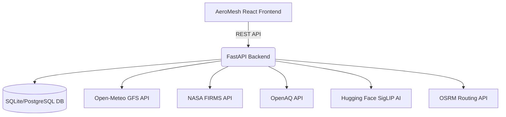

# AeroMesh: Federated Air Pollution Plume Detection & Transboundary Alert Engine


> **AeroMesh** is a real-time, federated platform designed to detect, track, and mitigate transboundary air pollution across the BRICS nations and beyond. By combining live satellite thermal anomaly data (NASA FIRMS), global wind vectors (NOAA GFS via Open-Meteo), and real-time ground sensor measurements (OpenAQ), AeroMesh provides an ultra-fast, visually stunning Command Center for environmental officers and a seamless, AI-powered reporting portal for citizens.

---

## 📑 Table of Contents

1. [Executive Summary](#1-executive-summary)
2. [The Problem: Transboundary Air Pollution](#2-the-problem-transboundary-air-pollution)
3. [The Solution: AeroMesh BRICS Node](#3-the-solution-aeromesh-brics-node)
4. [Key Features](#4-key-features)
5. [System Architecture](#5-system-architecture)
6. [Core Modules & Technical Deep Dive](#6-core-modules--technical-deep-dive)
    - [Live GFS Tracer Transport Engine](#live-gfs-tracer-transport-engine)
    - [Citizen Vision AI (SigLIP)](#citizen-vision-ai-siglip)
    - [Hardware-Accelerated Map Rendering](#hardware-accelerated-map-rendering)
    - [OSRM Dispatch Routing](#osrm-dispatch-routing)
7. [User Workflows & Interfaces](#7-user-workflows--interfaces)
8. [Data Sources & Integrations](#8-data-sources--integrations)
9. [Setup & Installation Guide](#9-setup--installation-guide)
10. [Environment Configuration](#10-environment-configuration)
11. [API Documentation Reference](#11-api-documentation-reference)
12. [Design System & UX/UI](#12-design-system--uxui)
13. [Performance Optimizations](#13-performance-optimizations)
14. [Future Roadmap](#14-future-roadmap)
15. [Contributing](#15-contributing)
16. [License & Acknowledgements](#16-license--acknowledgements)

---

## 1. Executive Summary

AeroMesh was built to solve a massive geographic and diplomatic challenge: air pollution does not respect national borders. Agricultural fires in one jurisdiction rapidly become severe respiratory hazards in neighboring territories. AeroMesh serves as an early-warning system and a citizen-engagement platform. It ingests thousands of live data points, calculates atmospheric dispersion mathematically in real-time, and presents actionable intelligence on a gorgeous, high-performance web dashboard.

---

## 2. The Problem: Transboundary Air Pollution

In many regions, seasonal agricultural burning, industrial accidents, and wildfires produce massive smoke plumes. These plumes are carried by wind across state and national borders, creating diplomatic friction and severe public health crises.

**Key Challenges:**
- **Fragmented Data:** Wind forecasts, fire locations, and ground sensors are hosted by entirely different organizations (NOAA, NASA, OpenAQ).
- **Complex Modeling:** Running operational dispersion models like HYSPLIT usually requires expensive compute clusters, proprietary API keys, and lengthy execution times.
- **Citizen Disconnect:** When citizens see a fire, they lack a dedicated, centralized platform to report the visual evidence to the authorities who are tracking the telemetry.
- **Performance Bottlenecks:** Rendering thousands of meteorological vectors and sensor circles on a web map typically crashes the browser or causes extreme lag.

---

## 3. The Solution: AeroMesh BRICS Node

AeroMesh acts as a centralized "Node" that can be deployed by any participating nation (e.g., India Node, Brazil Node). It seamlessly aggregates the fragmented data streams into a single, cohesive interface.

Rather than relying on closed APIs for dispersion modeling, AeroMesh features a completely custom, in-house **2D Passive-Tracer Transport Engine** written in Python. This engine fetches raw meteorological data and calculates the dispersion mathematically, providing real-time plume animations directly to the browser.

---

## 4. Key Features

### 🌪️ Real-Time Atmospheric Dispersion
- Generates dynamic, animated smoke plumes based on live wind data.
- Bypasses the need for official NOAA HYSPLIT registration by mathematically calculating Runge-Kutta dispersion locally.
- Exports results as perfectly smoothed GeoJSON contour polygons using the `contourpy` library.

### 🤖 Computer Vision Citizen Reporting
- A dedicated mobile-friendly Citizen Portal.
- Citizens upload photos of environmental hazards (fires, factory smoke).
- The backend automatically analyzes the image using a **Hugging Face zero-shot classification model (SigLIP)** to verify the contents before alerting officers.

### 🗺️ Hardware-Accelerated 60fps Mapping
- Replaced traditional SVG Leaflet layers with native Canvas rendering.
- Implements `zoomend` optimization to ensure 60fps buttery-smooth map navigation, even when rendering 10,000+ data points simultaneously.

### 🚑 Automated Dispatch Routing
- Automatically calculates the driving distance and travel time from the nearest environmental response unit to a reported hazard using the **Open Source Routing Machine (OSRM)** API.

---

## 5. System Architecture

AeroMesh is split into a modular backend and frontend, designed for high availability and rapid data ingestion.



### Backend Stack
- **Framework:** FastAPI (Python 3)
- **Database:** SQLAlchemy ORM (compatible with SQLite for prototyping and PostgreSQL for production)
- **Task Scheduling:** APScheduler for periodic ingestion of satellite data.
- **Math & Geospatial:** NumPy, Contourpy for calculating wind physics and polygons.
- **AI Integration:** Transformers library (`pipeline`) for zero-shot image classification.

### Frontend Stack
- **Framework:** React 18 (via Vite)
- **Styling:** Tailwind CSS (Custom glassmorphism & dark mode design system)
- **Mapping:** React-Leaflet (configured strictly for Canvas-based rendering)
- **Routing:** React Router DOM

---

## 6. Core Modules & Technical Deep Dive

### Live GFS Tracer Transport Engine (`transport.py`)
Because official NOAA APIs require strict university credentials, we engineered a completely custom 2D passive-tracer atmospheric model.
- **How it works:** It queries the Open-Meteo API for a grid of 10-meter wind vectors (speed and direction). 
- **The Physics:** It drops 2,048 simulated "particles" at the site of a fire. Using Runge-Kutta midpoint integration (`dx = u dt + sqrt(2K dt) dW`), it calculates how the wind carries and diffuses the particles over a set duration.
- **The Output:** It calculates a 2D histogram of the particles and uses `contourpy` to draw outer-offset polygons representing the pollution plume.

### Citizen Vision AI (SigLIP) (`operations.py`)
To prevent spam in the dispatch center, citizen photo uploads are run through a local AI model.
- **Model:** `google/siglip-base-patch16-224`
- **Execution:** It runs in a zero-shot classification pipeline. The model is asked to score the probability that the image contains concepts like "wildfire", "industrial smoke", "factory", or "smog".
- **Result:** If the confidence exceeds 50%, the report is automatically marked as "High Priority" and flashed onto the Officer Dashboard map.

### Hardware-Accelerated Map Rendering (`MapView.jsx`)
Leaflet maps notoriously lag when dealing with thousands of SVG DOM elements.
- **The Fix:** We strictly enforced `preferCanvas` on the MapContainer, bypassing the DOM entirely.
- **The Polish:** We completely removed dynamic `zoom` event listeners that force React to rapidly re-render during animations. By using `zoomend` and fixed pixel-sized `CircleMarkers` (3px for sensors, 5px for fires), the map achieves a flawless 60 frames-per-second regardless of zoom velocity.

### OSRM Dispatch Routing
When a confirmed hazard is detected, the system calculates a response vector.
- Instead of relying on a straight-line "Haversine" distance (which ignores roads and mountains), the backend pings the **OSRM API**.
- It calculates the exact driving distance and estimated time of arrival (ETA) for dispatchers.

---

## 7. User Workflows & Interfaces

AeroMesh explicitly divides the user experience into two completely isolated operational domains to ensure zero friction.

### 🛡️ The Command Center (Officer Dashboard)
- **Target Audience:** Government officials, dispatchers, environmental scientists.
- **Access:** `http://localhost:5173/map`
- **Features:** 
  - A panoramic dark-mode interface with frosted-glass sidebars.
  - Interactive timeline scrubber to view historical and forecasted wind data.
  - Live toggles for Air Quality Index (AQI), Sensor points, and Active Fires.
  - An **AI Evidence Panel** that slides in when clicking a map marker, providing satellite timestamps, weather metrics, and dispatch buttons.

### 📱 The Citizen Portal
- **Target Audience:** Civilians, hikers, local residents.
- **Access:** `http://localhost:5173/report`
- **Features:**
  - A mobile-first, heavily padded interface with massive tap targets.
  - Form fields for coordinates, description, and direct image uploads.
  - A success screen featuring a dynamic **"View on Map"** button. Clicking this executes a custom `flyTo` animation, seamlessly transitioning the user from the portal into the dashboard and zooming the camera directly onto their reported hazard.

---

## 8. Data Sources & Integrations

AeroMesh is a "System of Systems". It relies on the reliable ingestion of upstream scientific data.

| Provider | Data Type | Refresh Rate | Purpose |
|----------|-----------|--------------|---------|
| **Open-Meteo** | GFS Wind Vectors & CAMS AQI | Hourly | Drives the transport physics engine and the visual wind-layer animations. |
| **NASA FIRMS** | VIIRS/MODIS Thermal Anomalies | Daily/Hourly | Identifies active wildfires, agricultural burns, and industrial heat sources. |
| **OpenAQ** | PM2.5 & Ground Sensor Telemetry | Hourly | Validates the atmospheric models with hard, localized ground truths. |
| **WAQI** | Real-time AQI Heatmap Tile Layers | Live | Provides the continuous, color-coded visual pollution map on the dashboard. |
| **OSRM** | OpenStreetMap Routing | On-Demand | Provides driving instructions and distance metrics for response teams. |

---

## 9. Setup & Installation Guide

To run AeroMesh locally, you must launch both the backend server and the frontend client.

### Prerequisites
- Python 3.10+
- Node.js 18+
- npm or yarn

### Step 1: Start the Backend (FastAPI)
The backend manages the SQLite database, AI models, and background tasks.

```bash
# Navigate to the backend directory
cd backend

# Create and activate a virtual environment
python3 -m venv venv
source venv/bin/activate  # On Windows use: venv\Scripts\activate

# Install the dependencies
pip install -r requirements.txt

# Start the Uvicorn ASGI server
uvicorn main:app --reload
```
*The backend API will now be running at `http://localhost:8000`.*

### Step 2: Start the Frontend (Vite/React)
The frontend serves the user interfaces.

```bash
# Open a NEW terminal window and navigate to the frontend
cd frontend

# Install the Node dependencies
npm install

# Start the Vite development server
npm run dev
```
*The web app will now be running at `http://localhost:5173`.*

---

## 10. Environment Configuration

The backend utilizes a `.env` file for API keys and configuration. While the system is designed to degrade gracefully (using free open APIs by default), you can supply keys to increase rate limits.

Create a `.env` file in the `backend/` directory:

```env
# Database Settings
DATABASE_URL=sqlite:///./aeromesh.db

# Open-Meteo (Optional, for higher rate limits)
OPEN_METEO_API_KEY=your_key_here
OPEN_METEO_BASE_URL=https://api.open-meteo.com/v1

# NASA FIRMS (Optional, currently uses open endpoints)
FIRMS_API_KEY=your_key_here

# Hugging Face (Optional, models are downloaded locally by default)
HF_TOKEN=your_token_here
```

---

## 11. API Documentation Reference

FastAPI automatically generates interactive Swagger documentation. Once the backend is running, navigate to:
👉 **`http://localhost:8000/docs`**

### Key Endpoints:
- `GET /api/data/sensors` - Retrieves all OpenAQ ground truth sensors for the active node.
- `GET /api/data/events` - Retrieves all NASA thermal anomalies and verified Citizen reports.
- `POST /api/citizen/report` - Accepts multipart form data (text + images), runs the SigLIP AI classification, and commits the report to the database.
- `POST /api/dispersion/run` - Triggers the background Runge-Kutta math engine for a specific fire.
- `GET /api/dispersion/contours` - Serves the calculated GeoJSON polygons.

---

## 12. Design System & UX/UI

AeroMesh features a strict, premium design philosophy:
- **Aesthetics:** Deep blacks (`#0d1117`), frosted glass panels (`backdrop-blur`), and vibrant semantic colors (Green for clear, Amber for warning, Orange/Red for hazard).
- **Typography:** Relies heavily on modern sans-serif scaling to create a dramatic hierarchy without relying on generic clutter.
- **Micro-Animations:** Elements fade and slide up (`translateY`) smoothly on mount. The `AIEvidencePanel` expands seamlessly without jarring page reloads.

---

## 13. Performance Optimizations

Web maps plotting tens of thousands of points are inherently prone to extreme browser thread locking. We mitigated this by:
1. **Dumping SVG:** Forcing Leaflet to use `preferCanvas`. SVG scales poorly with DOM depth; Canvas is a single rasterized element.
2. **Debouncing Zoom States:** Removing the `zoom` event listener (which fires ~60 times a second during a scroll) and replacing it with `zoomend`. This ensures React only reconciles the virtual DOM *after* the hardware-accelerated zoom animation finishes.
3. **Static Radius Toggles:** Scrapping the dynamic `Math.cos()` meter-per-pixel mathematical scaling on markers in favor of hyper-efficient, hard-coded 3px and 5px pixel radii.

---

## 14. Future Roadmap

While AeroMesh is highly capable, future iterations aim to expand its capabilities:
- **3D Vertical Transport:** Upgrading the 2D tracer to a full 3D atmospheric model using pressure-level meteorological data.
- **WebSocket Telemetry:** Replacing REST polling with WebSocket connections for true real-time marker updates on the map.
- **Mobile Native Application:** Wrapping the Citizen Portal in React Native to access native device sensors (gyroscope, compass) for exact camera bearing telemetry during photo captures.

---

## 15. Contributing

We welcome contributions from environmental scientists, AI researchers, and full-stack engineers.
1. Fork the repository.
2. Create your feature branch (`git checkout -b feature/AmazingFeature`).
3. Commit your changes (`git commit -m 'Add some AmazingFeature'`).
4. Push to the branch (`git push origin feature/AmazingFeature`).
5. Open a Pull Request.

---

## 16. License & Acknowledgements

**AeroMesh** is released under the **MIT License**.

This project relies on the incredible open data provided by:
- **NASA** (FIRMS / MODIS / VIIRS)
- **NOAA & ECMWF** (Via Open-Meteo)
- **OpenAQ** (Global Air Quality Community)
- **WAQI** (World Air Quality Index Project)
- **Hugging Face** (Open Source AI Models)
