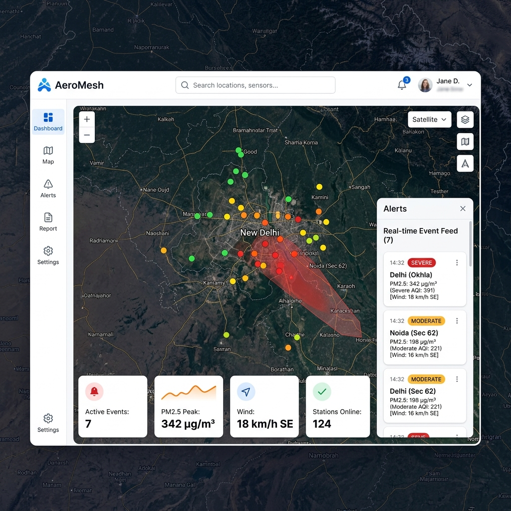
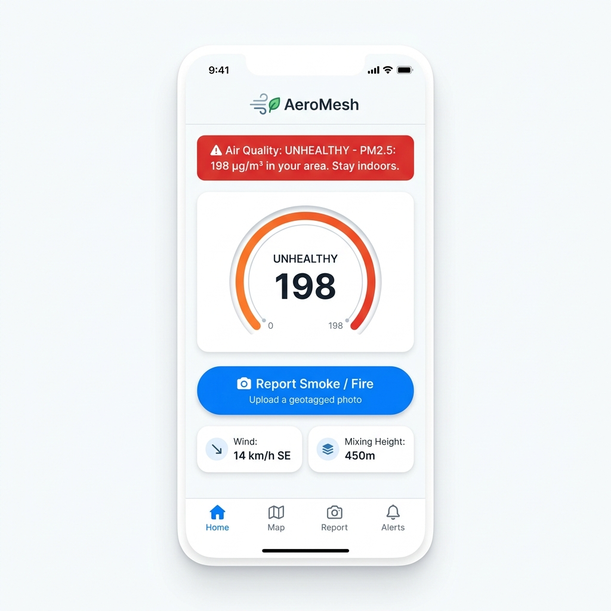

# AeroMesh — UI/UX Design Consultation & Design System

> **Document Type**: Design Reference (Permanent)
> **Consultant**: AI Design Consultant
> **Status**: ✅ Approved Design Direction
>
> This document is the single source of truth for every visual and UX decision made in AeroMesh. Any frontend developer building a component should reference this first.

---

## Table of Contents
1. [Design Philosophy & Core Insight](#1-design-philosophy--core-insight)
2. [The Three Design Pillars](#2-the-three-design-pillars)
3. [Real-World Design Inspirations](#3-real-world-design-inspirations)
4. [Color System](#4-color-system)
5. [Typography](#5-typography)
6. [Spacing System](#6-spacing-system)
7. [Layout — Desktop Command Center](#7-layout--desktop-command-center)
8. [Layout — Mobile Citizen Portal](#8-layout--mobile-citizen-portal)
9. [Component Design Guidelines](#9-component-design-guidelines)
10. [Page & Route Inventory](#10-page--route-inventory)
11. [What We Rejected & Why](#11-what-we-rejected--why)

---

## 1. Design Philosophy & Core Insight

### The One-Line Design Principle
> **AeroMesh should feel like "Windy.com meets a government operations center."**

The fleet management dashboard reference was useful as an example of **clean, spacious, professional design**. But AeroMesh is not a fleet tracker. It is an **environmental crisis response tool** used by:
- Government officers under pressure during pollution events
- Municipal inspectors dispatching anti-smog squads
- Citizens checking local air quality on their phones

Each user group has a completely different context, stress level, and goal. The design must serve all three.

### The Core Insight: The Map IS the Product
AeroMesh's #1 value is geospatial — where pollution is, where it's going, and what's in its path. A dashboard that buries the map inside a grid of data tables would completely undermine the product's core value proposition.

```
❌ WRONG APPROACH:     [Data Tables | Charts | Reports] → small map widget at bottom
✅ RIGHT APPROACH:     [FULL-SCREEN MAP] ← floating stat cards, slide-in alerts overlaid on top
```

Every layout decision flows from this: **maximize map space, make everything else secondary and dismissible.**

---

## 2. The Three Design Pillars

### Pillar 1: 🗺️ Map-First Interface
- **Map occupies 65–70% of the screen** at all times on desktop
- The map is the dashboard — not a tab, not a widget, not a section
- All other UI elements (sidebar, stat cards, alert panel) float above or flank the map
- **Dark satellite map tiles** as the basemap — because AQI color markers, fire hotspots, and plume overlays are all most readable on a dark background
- The UI chrome (sidebar, topbar, cards) stays light white — this contrast between dark map and light panels creates a premium, professional feel

### Pillar 2: 🚨 EPA-Standard AQI Color Language
Environmental professionals globally recognize one color language for air quality. Using it means **zero learning curve for users and hackathon judges**:

| AQI Range | Label | Color |
| :--- | :--- | :--- |
| 0–50 | Good | 🟢 Green |
| 51–100 | Moderate | 🟡 Yellow |
| 101–150 | Unhealthy (Sensitive) | 🟠 Orange |
| 151–200 | Unhealthy | 🔴 Red |
| 201–300 | Very Unhealthy | 🟣 Purple |
| 301+ | Hazardous | 🟤 Maroon |

These AQI colors are exclusively for **data elements** (sensor markers, plume overlays, gauge rings, severity badges). Generic UI elements like buttons, nav items, and dividers use the standard interface palette.

### Pillar 3: 🧘 Calm Clarity Under Crisis
During a pollution event, operators are stressed and making time-critical decisions. The UI must reduce cognitive load, not add to it:
- Clean white/off-white surfaces for panels and cards
- Large, immediately scannable numbers (28–32px bold) for metrics
- Status badges that communicate severity in one glance (color + text label)
- Progressive disclosure: summary visible first → click/tap for detail
- No decorative animations that distract from data

---

## 3. Real-World Design Inspirations

Study these products before building any screen:

| Product | URL | What to Learn |
| :--- | :--- | :--- |
| **Windy.com** | [windy.com](https://www.windy.com) | Map-first layout, floating translucent control panels, wind particle layer, dark satellite base + light chrome UI |
| **IQAir / AirVisual** | [iqair.com/air-quality-map](https://www.iqair.com/air-quality-map) | AQI color scale implementation, sensor marker cluster design, health advisory card pattern |
| **PurpleAir Map** | [map.purpleair.com](https://map.purpleair.com) | Real-time AQI-colored sensor dots on dark map, dense but readable |
| **NASA Worldview** | [worldview.earthdata.nasa.gov](https://worldview.earthdata.nasa.gov) | Satellite imagery layer handling, multi-source layer toggle UI |
| **Linear.app** | [linear.app](https://linear.app) | Study the craftsmanship: spacing, Inter typography, subtle shadows, micro-transitions |

---

## 4. Color System

### 4a. Interface Palette (UI Chrome)
For sidebars, topbars, cards, panels, buttons, and text.

| Token Name | Hex | Tailwind Class | Usage |
| :--- | :--- | :--- | :--- |
| `--color-page-bg` | `#f8fafc` | `bg-slate-50` | Main page canvas behind all panels |
| `--color-surface` | `#ffffff` | `bg-white` | Cards, sidebar, topbar, floating panels |
| `--color-surface-hover` | `#f1f5f9` | `bg-slate-100` | Nav item hover, row hover states |
| `--color-primary` | `#2563eb` | `bg-blue-600` | CTA buttons, active nav icon, links |
| `--color-primary-tint` | `#eff6ff` | `bg-blue-50` | Active nav background, highlighted rows |
| `--color-border` | `#e2e8f0` | `border-slate-200` | Card borders, table row dividers, section lines |
| `--color-border-strong` | `#cbd5e1` | `border-slate-300` | Input borders, stronger dividers |
| `--color-text-primary` | `#0f172a` | `text-slate-900` | Headings, metric values, important labels |
| `--color-text-secondary` | `#64748b` | `text-slate-500` | Subtitles, timestamps, metadata, helper text |
| `--color-text-disabled` | `#94a3b8` | `text-slate-400` | Disabled inputs, placeholder text |

### 4b. AQI Data Palette (Sensor Markers, Badges, Gauges, Plume Overlays)
> ⚠️ Use ONLY for air quality data visualization — never for generic UI elements.

| AQI Level | Label | Hex | Use For |
| :--- | :--- | :--- | :--- |
| Good | `GOOD` | `#00e400` | Green sensor dots, good badge, gauge arc |
| Moderate | `MODERATE` | `#ffff00` | Yellow sensor dots, moderate badge |
| Unhealthy for Sensitive | `USG` | `#ff7e00` | Orange sensor dots, USG badge |
| Unhealthy | `UNHEALTHY` | `#ff0000` | Red sensor dots, unhealthy badge |
| Very Unhealthy | `VERY UNHEALTHY` | `#8f3f97` | Purple sensor dots, dispatch trigger color |
| Hazardous | `HAZARDOUS` | `#7e0023` | Maroon, highest severity, plume polygon fill |

### 4c. Map Colors
| Element | Color | Opacity |
| :--- | :--- | :--- |
| Plume polygon fill | `#ff0000` → `#7e0023` (gradient by severity) | 0.25–0.45 |
| Plume polygon border | `#ff0000` | 0.7 |
| Fire hotspot marker | `#ff4500` (orange-red) | 1.0 |
| Wind vector arrow | `#60a5fa` (blue-400) | 0.8 |
| Corridor boundary line | `#f59e0b` (amber-400) | 0.9 |

---

## 5. Typography

Font Family: **Inter** (loaded from Google Fonts CDN in `index.html`)

| Element | Size | Weight | Line Height | Tailwind |
| :--- | :--- | :--- | :--- | :--- |
| Page / View Title | 24px | 600 SemiBold | 1.3 | `text-2xl font-semibold` |
| Section Heading | 16px | 600 SemiBold | 1.4 | `text-base font-semibold` |
| KPI / Metric Value | 28–32px | 700 Bold | 1.1 | `text-3xl font-bold` |
| Card Label (uppercase) | 11px | 500 Medium | 1.4 | `text-xs font-medium uppercase tracking-widest` |
| Body / Description | 14px | 400 Regular | 1.6 | `text-sm` |
| Table Cell | 14px | 400–500 | 1.5 | `text-sm` |
| Badge / Pill | 11px | 600 SemiBold | 1.0 | `text-xs font-semibold` |
| Caption / Metadata | 12px | 400 Regular | 1.4 | `text-xs text-slate-500` |
| Nav Label (tooltip) | 12px | 500 Medium | 1.0 | `text-xs font-medium` |

---

## 6. Spacing System

Base unit: **4px**

| Token | Value | Tailwind | Usage |
| :--- | :--- | :--- | :--- |
| `xs` | 4px | `p-1` / `gap-1` | Internal icon padding |
| `sm` | 8px | `p-2` / `gap-2` | Tight element spacing |
| `md` | 16px | `p-4` / `gap-4` | Standard form element gap |
| `lg` | 24px | `p-6` / `gap-6` | Card padding, section gap |
| `xl` | 32px | `p-8` / `gap-8` | Page section margins |
| `2xl` | 48px | `p-12` / `gap-12` | Large section separation |

**Specific component spacing:**
- Card internal padding: `p-6` (24px)
- Card gap in a grid: `gap-4` (16px)
- Sidebar item padding: `py-2.5 px-3` (10px / 12px)
- Table row min-height: `48px`
- Card border radius: `rounded-xl` (12px)
- Button border radius: `rounded-lg` (8px)
- Badge border radius: `rounded-full` (pill)
- Topbar height: `56px` (`h-14`)
- Sidebar width: `72px` (`w-18`) — icons only

---

## 7. Layout — Desktop Command Center

### Visual Mockup

> *(Reference mockup generated during design consultation)*



### Layout Structure

```
┌─────────────────────────────────────────────────────────────────────────┐
│  TOPBAR (h-14, bg-white, border-b)                                      │
│  [AeroMesh Logo]  [Search: "Search locations, sensors..."]  [Node ▾] [🔔] [👤]  │
├────────────┬────────────────────────────────────────────────────────────┤
│            │                                                            │
│  SIDEBAR   │     FULL-BLEED MAP (Leaflet, dark satellite tiles)        │
│  (w-18)    │                                                            │
│  bg-white  │   Layers rendered on map:                                 │
│  border-r  │   • AQI-colored sensor markers (clustered at zoom-out)    │
│            │   • Translucent red/purple plume polygon                  │
│  🏠 Dashboard   • Orange-red NASA fire hotspot markers                 │
│  🗺️ Map    │   • Blue wind vector arrows                               │
│  ⚠️ Alerts │   • Yellow corridor boundary lines (Punjab→Delhi etc.)    │
│  📸 Report │                                                            │
│  📊 History│   FLOATING MAP CONTROLS (top-right corner of map):        │
│            │   [Satellite ▾] [Layers ≡] [Zoom +/−]                    │
│  ─────────│                                                            │
│  ⚙️ Settings│   FLOATING KPI STRIP (bottom of map, semi-transparent):  │
│            │   ┌──────────┐ ┌──────────┐ ┌──────────┐ ┌──────────┐   │
│            │   │Events: 7 │ │PM2.5:342 │ │Wind:18SE │ │Online:124│   │
│            │   └──────────┘ └──────────┘ └──────────┘ └──────────┘   │
│            │                                                            │
│            │   SLIDE-IN EVENT PANEL (right edge, w-90, dismissible):  │
│            │   ┌──────────────────────────────────┐                   │
│            │   │ Real-time Event Feed          [✕] │                   │
│            │   ├──────────────────────────────────┤                   │
│            │   │ 14:32  🔴 SEVERE                  │                   │
│            │   │ Delhi (Okhla) · PM2.5: 342        │                   │
│            │   │ AQI: 391 · Wind: 18 km/h SE        │                   │
│            │   ├──────────────────────────────────┤                   │
│            │   │ 14:32  🟠 MODERATE               │                   │
│            │   │ Noida (Sec 62) · PM2.5: 198       │                   │
│            │   └──────────────────────────────────┘                   │
└────────────┴────────────────────────────────────────────────────────────┘
```

### Critical Desktop Rules
1. **The map fills the entire remaining viewport** after topbar and sidebar. No fixed-height sections.
2. **KPI cards float INSIDE the map** at the bottom using `absolute` positioning — they do NOT push the map up.
3. **The alert panel slides in from the right** overlaying the map edge. A `[✕]` closes it. Opening it doesn't resize the map.
4. **Sidebar shows icons only** (72px). Hovering an icon shows a tooltip with the label. Clicking navigates. No text labels taking up map space.
5. **Layer toggles are inside the map** (top-right map controls) — users can turn on/off Sensors, Plumes, Fire Spots, Wind, Corridors independently.

---

## 8. Layout — Mobile Citizen Portal

### Visual Mockup



### Layout Structure

```
┌────────────────────────────────────┐
│  AeroMesh (logo, centered, 20px)   │
├────────────────────────────────────┤
│  ALERT BANNER (full-width)         │
│  bg-red-600, white text            │
│  "⚠️ Air Quality: UNHEALTHY        │
│   PM2.5: 198 µg/m³. Stay indoors." │
├────────────────────────────────────┤
│                                    │
│      AQI CIRCULAR GAUGE            │
│   (SVG arc colored by AQI level)  │
│                                    │
│           UNHEALTHY                │
│              198                   │
│        (32px bold, centered)       │
│                                    │
├────────────────────────────────────┤
│                                    │
│  ┌──────────────────────────────┐  │
│  │  📸  Report Smoke / Fire     │  │
│  │  Upload a geotagged photo    │  │
│  └──────────────────────────────┘  │
│  (bg-blue-600, full-width, h-14)   │
│                                    │
├────────────────────────────────────┤
│  ┌───────────┐  ┌───────────┐     │
│  │ Wind      │  │ Mix.Height│     │
│  │ 14 km/h SE│  │  450m     │     │
│  └───────────┘  └───────────┘     │
├────────────────────────────────────┤
│  TAB BAR (h-16, bg-white, border-t)│
│  [🏠 Home] [🗺️ Map] [📸 Report] [⚠️ Alerts] │
└────────────────────────────────────┘
```

### Critical Mobile Rules
1. **No login required** for citizens. Report anonymously with GPS only. Auth only for admin/inspector roles.
2. **Alert banner color matches current AQI level** — green banner if air is good (don't alarm unnecessarily), red/maroon if hazardous.
3. **Circular gauge not a number widget** — citizens need "UNHEALTHY" not "198 µg/m³". Both are shown but the label is larger.
4. **Report button is massive** — full-width, 56px tall, bright blue. Impossible to miss. This is the #1 citizen action.
5. **Bottom tab bar is native-feeling** — citizens recognize this pattern from every app they've used.
6. **Wind & Mixing Height mini-cards** — these help citizens understand WHY the air is bad today (is it a windy dispersal day or a trapped smog day?).

---

## 9. Component Design Guidelines

### `<StatCard />` — KPI Metric Card
```
┌─────────────────────────┐
│ 🔴  [icon, 16px]        │ ← icon color matches severity or category
│                         │
│ ACTIVE EVENTS           │ ← 11px, uppercase, tracking-widest, slate-500
│ 7                       │ ← 28px, font-bold, slate-900
│ ▲ 3 since last hour     │ ← 12px, trend indicator (green↑ / red↑)
└─────────────────────────┘
```
- `bg-white`, `rounded-xl`, `shadow-sm`, `border border-slate-100`, `p-6`
- When floating on map: `bg-white/90 backdrop-blur-sm`

### `<StatusBadge />` — Severity Pill
- Shape: `rounded-full`, `px-2.5 py-0.5`, `text-xs font-semibold`
- Color is determined by AQI level from the data palette
- Always includes the text label (never just color alone — for accessibility)
- Example: `<StatusBadge level="SEVERE" />` → red pill with "SEVERE" text

### `<AlertCard />` — Event Feed Item
```
┌──────────────────────────────────────────────────────┐
│  14:32  🔴 SEVERE  ·  Delhi (Okhla)            [⋮]  │
│  PM2.5: 342 µg/m³  ·  AQI: 391  ·  Wind: 18 km/h    │
│  Source: Biomass Burning (92% confidence)            │
└──────────────────────────────────────────────────────┘
```
- `bg-white`, `rounded-lg`, `border border-slate-100`, `p-4`, `hover:bg-slate-50`
- Left border accent: 3px solid, color = AQI severity color
- Clicking expands to show plume forecast + dispatch options

### `<MapView />` — Interactive Map
- Library: `react-leaflet` + `leaflet`
- Tile layer: `https://{s}.basemaps.cartocdn.com/dark_all/{z}/{x}/{y}{r}.png` (CartoDB Dark Matter — free, no API key)
- Layer toggles: Sensors, Plumes, Fire Hotspots, Wind Vectors, Corridors
- Sensor markers: Circular, colored by AQI, clustered at zoom < 10
- Plume overlay: Leaflet `Polygon` with semi-transparent fill

### `<AQIGauge />` — Circular Gauge (Mobile)
- SVG arc path from 135° to 405° (270° sweep)
- Arc color = current AQI level color
- Center: large AQI number (32px bold) + level label (14px medium)
- Background arc: `#e2e8f0` (slate-200)

---

## 10. Page & Route Inventory

| Route | View Name | Primary User | Key Elements |
| :--- | :--- | :--- | :--- |
| `/` | **Command Center Dashboard** | Inspector, Admin | Full-screen map + floating KPI strip + slide-in event feed |
| `/map` | **Full Map View** | Inspector | Map with all layers enabled + expanded layer control panel |
| `/alerts` | **Alert History** | Admin, Inspector | Paginated table, filter by severity/corridor/date, export |
| `/report` | **Citizen Reporting Portal** | Citizen (Mobile) | AQI gauge + report button + geotagged photo upload + AI result |
| `/admin` | **System Administration** | Admin only | Node health, registered users/roles, sensor status, API key management |

---

## 11. What We Rejected & Why

| Approach | Reason Rejected |
| :--- | :--- |
| **Dark/Glassmorphism UI** | Looks impressive but reduces readability under crisis pressure. Government officers need clarity, not aesthetics. |
| **Futuristic sci-fi theme** | Wrong emotional tone. AeroMesh is a public health tool, not a video game or hackathon showcase. |
| **Wide 240px text sidebar** | Wastes the most critical real estate — map space. Icon-only sidebar (72px) gives ~170px more map width. |
| **KPI row above the map** | Pushes the map down, reducing its height by 80-100px unnecessarily. KPIs float on the map instead. |
| **Fixed right-side panel** | Permanently divides screen. Slide-in panel lets users choose full map vs. data mode. |
| **Generic blue/green/red for alerts** | Loses the universal AQI standard that environmental professionals already understand. EPA colors are the industry language. |
| **Canvas 2D wind animation (60fps)** | Technically impressive but performance-heavy on low-end devices used by government offices in developing countries. Leaflet vector arrows are sufficient. |
